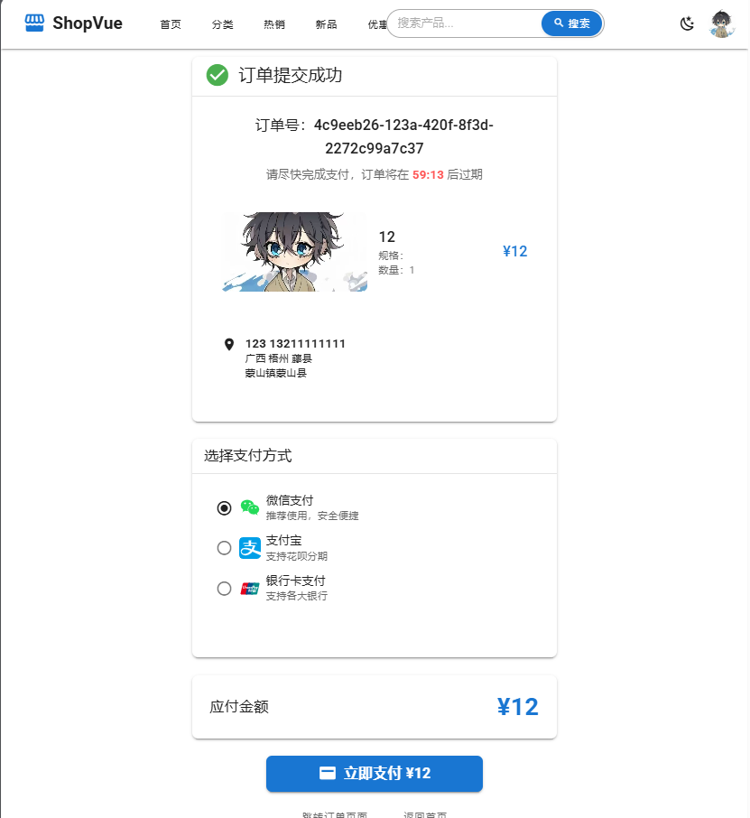

# 🛒 ShopVue 电商系统

<p align="center">
  
  
  
  
  
  
  
</p>

<p align="center">
  <strong>一个现代化的全栈电商解决方案</strong><br>
  包含完整的前端购物界面、后台管理系统和强大的API服务
</p>

## ✨ 项目特色

- 🎨 **现代化UI设计** - 基于Vuetify 3的Material Design界面
- 🌙 **深色模式支持** - 用户可自由切换明暗主题
- 📱 **响应式布局** - 完美适配桌面端和移动端
- ⚡ **高性能架构** - Spring Boot + Vue 3 + Redis缓存
- 🔐 **安全可靠** - JWT认证 + Redis Token管理
- 🛍️ **完整购物流程** - 从商品浏览到订单支付的完整体验

## 🏗️ 技术栈

### [后端](https://github.com/LiggMax/E-Commerce-Server)
* **核心框架**: Spring Boot 3.5.5
* **数据库**: MySQL 8.0
* **缓存**: Redis 6.0
* **ORM框架**: MyBatis-Plus
* **安全框架**: JWT + Redis Token管理
* **构建工具**: Maven

### [前端](https://github.com/LiggMax/E-Commerce-Vue)
* **框架**: Vue 3 + TypeScript
* **UI组件库**: Vuetify 3
* **路由**: Vue Router
* **状态管理**: Pinia
* **HTTP客户端**: Axios
* **构建工具**: Vite
* **后台管理地址**: http://localhost:3000/admin

## 📂 项目结构
```
E-commerce/                     # 仓库根目录（示例）
├── e-commerce-server/          # 后端服务（Spring Boot）
│   ├── common/                 # 公共模块（工具、常量等）
│   ├── entrance/               # 入口模块
│   ├── order/                  # 订单模块
│   ├── web/                    # Web API模块
│   │   ├── api-admin/          # 管理端 API
│   │   ├── api-client/         # 客户端 API
│   │   └── api-common/         # 公共 API 模块
│   └── sql/                    # 数据库脚本与初始化
│
└── e-commerce-vue/             # 前端应用（Vue 3 + TypeScript）
    ├── src/
    │   ├── pages/              # 页面组件
    │   │   ├── admin/          # 后台管理页面（Dashboard、管理页等）
    │   │   └── client/         # 客户端页面（首页、商品、用户中心等）
    │   ├── components/         # 公共可复用组件
    │   ├── layouts/            # 布局组件（Header/Footer/Layout）
    │   ├── views/              # 视图目录（按页面组织）
    │   ├── router/             # 路由配置
    │   ├── stores/             # Pinia 状态管理
    │   ├── http/               # API 封装（axios 实例与接口）
    │   ├── utils/              # 工具函数、通用帮助方法
    │   ├── assets/             # 静态资源（图片、样式等）
    │   └── main.ts             # 应用入口
    ├── public/                 # 公共静态资源（直接暴露）
    ├── index.html              # 前端入口页
    ├── package.json            # 依赖与脚本
    └── vite.config.ts          # Vite 配置
```


说明：
- 后端（e-commerce-server）为 Spring Boot 项目，包含模块化结构与数据库脚本。
- 前端（e-commerce-vue）为 Vue 3 + TypeScript + Vuetify 项目，按功能模块划分目录，方便维护与扩展。
- 以上为简洁且实用的目录视图，按需可以在对应目录下补充 README 或文档以说明每个子目录的详细用途。

## 🖼️ 系统界面展示

### 🏠 客户端界面

#### 首页展示

* 现代化首页设计，包含轮播图、商品分类和热门推荐
* 支持深色模式切换，提供更好的用户体验

#### 商品详情页

* 详细的商品信息展示，包含规格选择、价格计算
* 支持加入购物车和立即购买功能

#### 订单提交页

* 完整的订单信息确认，包含收货地址选择
* 清晰的订单摘要和价格计算

#### 订单支付页

* 实时倒计时提醒，确保订单及时支付

### 🛠️ 后台管理界面

#### 管理员登录

* 简洁的登录界面，支持记住登录状态
* 安全的身份验证机制

#### 管理仪表盘

* 全面的数据概览，包含用户统计、订单数据、系统状态
* 实时监控系统运行状况

#### 轮播图管理

* 可视化的轮播图管理界面
* 支持图片上传、排序、启用/禁用等操作

#### 商品管理

* 完整的商品信息管理
* 支持商品图片、价格、规格等信息的编辑

## 🚀 快速开始

### 环境要求
- Java 17+
- Node.js 16+
- MySQL 8.0+
- Redis 6.0+
- Maven 3.9+

### 后端启动
```bash
# 进入后端目录
cd e-commerce-server

# 安装依赖
mvn clean install

# 启动服务
mvn spring-boot:run
```

### 前端启动
```bash
# 进入前端目录
cd e-commerce-vue

# 安装依赖
yarn install

# 启动开发服务器
yarn dev
```

## 📋 功能特性

### 客户端功能
- ✅ 用户注册/登录
- ✅ 商品浏览与搜索
- ✅ 购物车管理
- ✅ 订单创建与支付
- ✅ 用户中心管理
- ✅ 收货地址管理
- ✅ 订单状态跟踪

### 后台管理功能
- ✅ 管理员登录认证
- ✅ 数据统计仪表盘
- ✅ 用户管理
- ✅ 商品管理
- ✅ 订单管理
- ✅ 轮播图管理
- ✅ 系统设置

## 🔧 配置说明

### 数据库配置
在 `application.yaml` 中配置数据库连接信息：
```yaml
spring:
  datasource:
    url: jdbc:mysql://localhost:3306/e_commerce
    username: your_username
    password: your_password
```

### Redis配置
```yaml
spring:
  redis:
    host: localhost
    port: 6379
    password: your_redis_password
```

## 📄 许可证

本项目采用 MIT 许可证 - 查看 [LICENSE](LICENSE) 文件了解详情

## 🤝 贡献

欢迎提交 Issue 和 Pull Request 来帮助改进项目！

## 📞 联系我们

如有问题或建议，请通过以下方式联系：
- 邮箱: admin@example.com
- 电话: 400-888-8888
